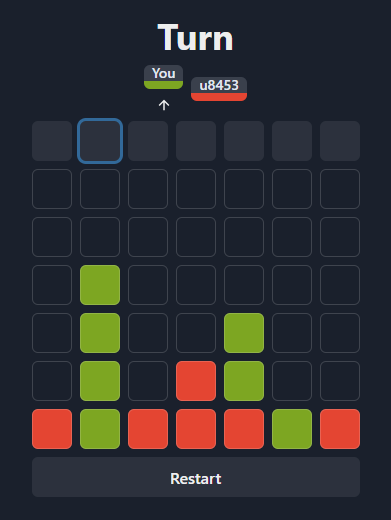

# Connect In The Dark

A Modification of Connect-Four where you can't see moves that other players take

## Development
`Rust-`[`warp`](https://github.com/seanmonstar/warp) backend 

`TypeScript-`[`NextJS`](https://nextjs.org/) frontend

run the development server with change-detection:
> Uses [`cargo-watch`](https://github.com/watchexec/cargo-watch) to monitor rust changes, and the provided builder for NextJS 
```bash
# Default PORTS:
#   frontend  3000
#   backend   8000
./dev.sh
```

## Config
- `PORT`: The listening port of the server (default is 8000).

## Deployment
The app is built into a Docker image for deployment on cloud platforms.

Build and run the image locally to test.  
Exposes the server to port 80, so that you can visit the app at 
[http://localhost](http://localhost)
```bash
./docker_build.sh
```

## Gameplay
- Clicks squares in the top row to drop a chip into a column.  
- The current player turn will be displayed above the board.
- When a player has met the win condition (4 in a row), the complete board become visible to all players.
- The game will continue even after there is a winner; if you wish to restart then you may do so at any time.
- If you disconnect from the game then you may rejoin using the same userID and roomID

## 
